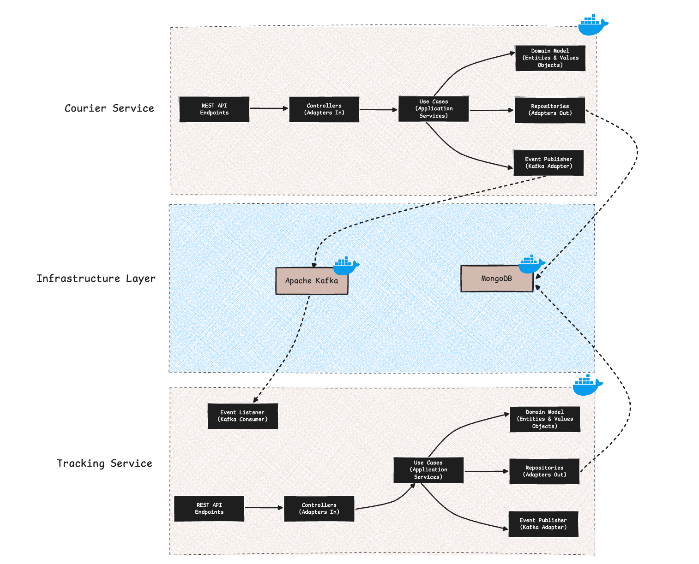
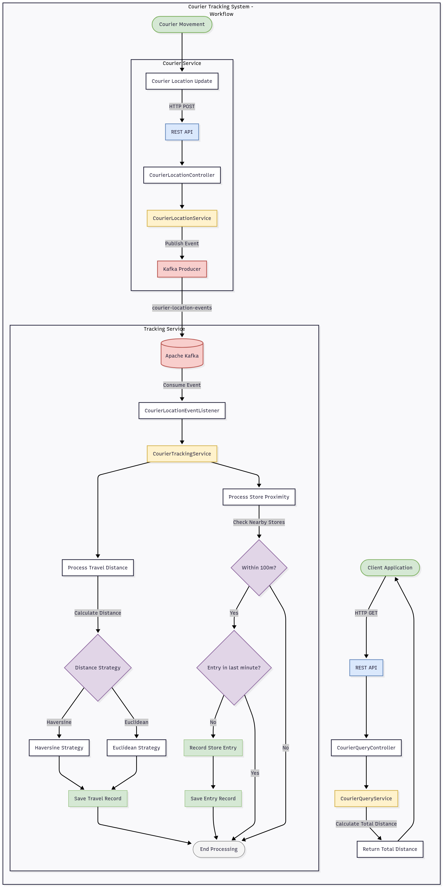

# Courier Tracking System

A robust, event-driven microservices architecture designed to track courier movements, calculate travel distances, and detect store entries in real-time with high performance caching.

## System Overview

This application implements a sophisticated courier tracking system that processes streaming geolocation data to monitor courier movements and detect when couriers enter store vicinities. The system is built using a hexagonal architecture approach with two primary microservices:

1. **Courier Service**: Manages courier data and location updates, exposing REST APIs for client applications and publishing events to Kafka
2. **Tracking Service**: Processes location events, calculates travel distances using configurable algorithms, and detects store entries based on proximity rules

## Architecture

The system follows modern software engineering practices with a clean, maintainable architecture:



### Hexagonal Architecture (Ports and Adapters)

The application is structured using the Hexagonal Architecture pattern, providing:

- **Domain Layer**: Core business logic and entities isolated from external concerns
- **Application Layer**: Use cases that orchestrate domain operations
- **Adapters Layer**: Input and output adapters for external communication
  - **Input Adapters**: REST controllers, event listeners
  - **Output Adapters**: Repositories, event publishers

### Event-Driven Architecture

- Kafka-based messaging for asynchronous communication between services
- Event-sourcing approach for location updates and store entry detection

### Caching Strategy

The system implements a sophisticated caching strategy using Redis:

- **Store Data Caching**: Store information is cached for 30 minutes to reduce database load
- **Proximity Calculations**: Results of nearby store calculations are cached to optimize repeated queries
- **Cache Invalidation**: Intelligent cache eviction policies ensure data consistency when stores are updated
- **Distributed Caching**: Redis provides a centralized cache accessible by all service instances

## Design Patterns

The system implements several design patterns to ensure maintainability and extensibility:

1. **Hexagonal Architecture (Ports and Adapters)**
   - Clear separation between domain, application, and infrastructure layers
   - Domain logic isolated from external concerns
   - Easily testable components with clear boundaries

2. **Strategy Pattern**
   - Interchangeable distance calculation strategies (Haversine and Euclidean)
   - Runtime strategy selection capability
   - Extensible for adding new calculation algorithms

3. **Repository Pattern**
   - Abstraction over data storage mechanisms
   - Clean separation between domain and persistence concerns
   - Facilitates testing with mock repositories

4. **Event-Driven Architecture**
   - Loose coupling between services
   - Asynchronous communication via Kafka
   - Improved scalability and resilience

5. **Cache-Aside Pattern**
   - Transparent caching of frequently accessed data
   - Reduced database load and improved response times
   - Intelligent cache invalidation strategies

## Technology Stack

- **Backend**: Java 17+, Spring Boot
- **Database**: MongoDB
- **Caching**: Redis
- **Messaging**: Apache Kafka
- **API Documentation**: Swagger/OpenAPI
- **Containerization**: Docker, Docker Compose
- **Build Tool**: Maven
- **Testing**: JUnit 5, Mockito

## API Endpoints

### Courier Service

#### Courier Management
- **POST** `/api/v1/couriers` - Create a new courier
- **GET** `/api/v1/couriers/{courierId}` - Get courier details
- **GET** `/api/v1/couriers` - List all couriers
- **PUT** `/api/v1/couriers/{courierId}` - Update courier information
- **DELETE** `/api/v1/couriers/{courierId}` - Delete a courier
- **POST** `/api/v1/couriers/{courierId}/activate` - Activate a courier
- **POST** `/api/v1/couriers/{courierId}/deactivate` - Deactivate a courier

#### Location Reporting
- **POST** `/api/v1/couriers/{courierId}/location` - Report courier location
  ```json
  {
    "lat": 40.9923307,
    "lng": 29.1244229,
    "time": "2023-01-01T12:00:00Z"  // Optional, defaults to current time
  }
  ```

#### Store Management
- **POST** `/api/v1/stores` - Create a new store
- **GET** `/api/v1/stores/{storeId}` - Get store details
- **GET** `/api/v1/stores` - List all stores
- **PUT** `/api/v1/stores/{storeId}` - Update store information
- **DELETE** `/api/v1/stores/{storeId}` - Delete a store

### Tracking Service

#### Courier Queries
- **GET** `/api/v1/couriers/{courierId}/total-travel-distance` - Get total travel distance for a courier
- **GET** `/api/v1/couriers/{courierId}/store-entries` - List store entries for a courier

## Running the Application

### Prerequisites
- Java 17+
- Docker and Docker Compose
- Maven

### Using Makefile

The project includes a comprehensive Makefile for common operations:

```bash
# First time setup
make setup

# Build both services
make build

# Start all services with Docker
make up

# Run all tests
make test

# Test the APIs
make api-test

# Show system status
make status

# Stop all services
make docker-down

# Clean up artifacts
make clean
```

## Configuration

Configuration is managed through Spring profiles:
- `local` - For local development
- `dev` - For development environment
- `prod` - For production environment

Environment-specific settings are in the respective application-{profile}.yml files.

## Store Entry Logic



The application implements sophisticated proximity detection to identify when couriers enter store vicinities:

1. When a courier location is reported, the system calculates the distance to all stores
2. If the courier is within 100 meters of a store, a potential store entry is detected
3. The system checks if the courier has already entered this store within the last minute
4. If no recent entry exists, a new store entry record is created
5. Re-entries to the same store within 1 minute are ignored to prevent duplicate records

## Distance Calculation

The system supports two distance calculation strategies:

1. **Haversine Formula (Default)**: Accounts for Earth's curvature, providing accurate distance calculations for geographical coordinates
2. **Euclidean Distance**: A simpler calculation for scenarios where precision is less critical

The strategy pattern allows easy switching between these algorithms or adding new ones as needed.

## Scalability Considerations

The system is designed for horizontal scalability:

- **Stateless Services**: All services can be scaled horizontally
- **Distributed Caching**: Redis provides a centralized cache accessible by all service instances
- **Message Broker**: Kafka enables asynchronous processing and load distribution
- **Container Orchestration**: Ready for deployment in Kubernetes or other container orchestration platforms

## Swagger Documentation

API documentation is available via Swagger UI:
- Courier Service: `http://localhost:8080/swagger-ui/index.html`
- Tracking Service: `http://localhost:8081/swagger-ui/index.html`

## Monitoring and Observability

The system exposes health and metrics endpoints:
- Health checks: `/actuator/health`
- Metrics: `/actuator/metrics`